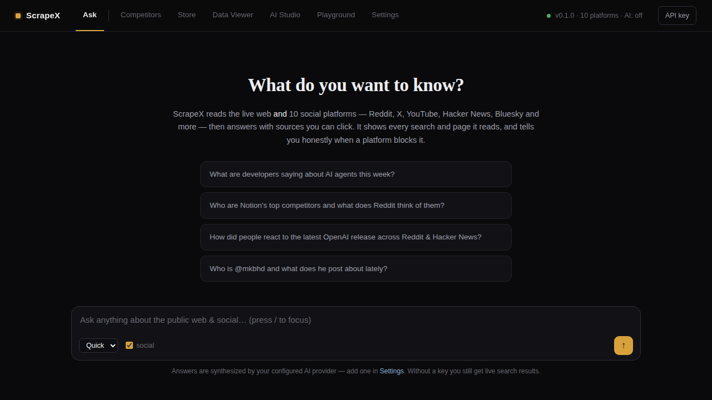
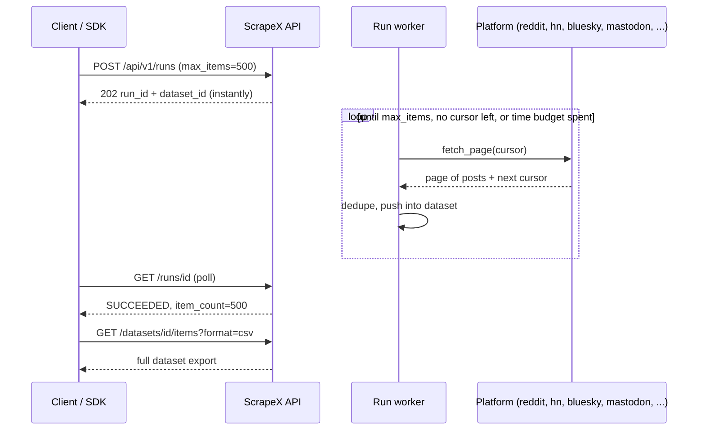
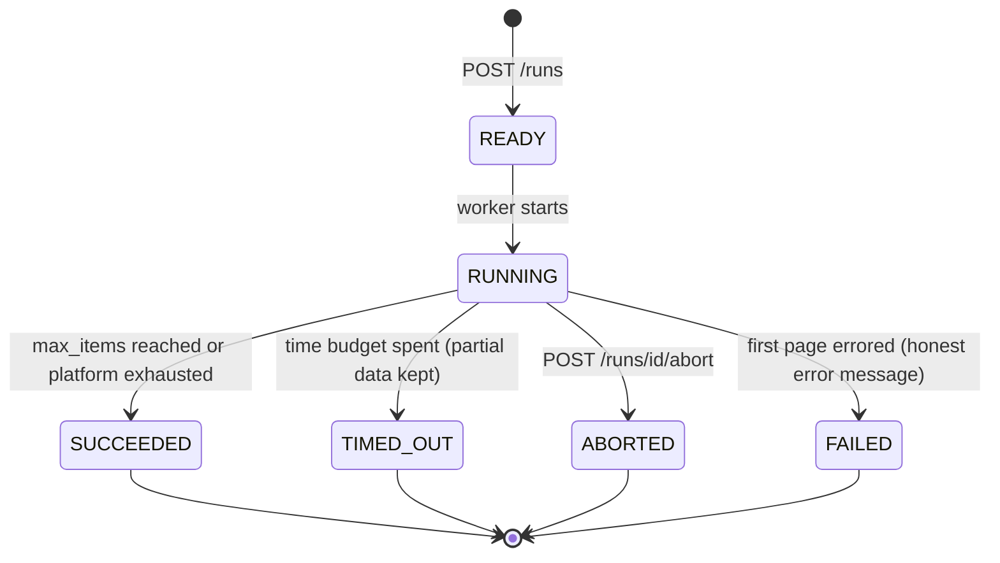
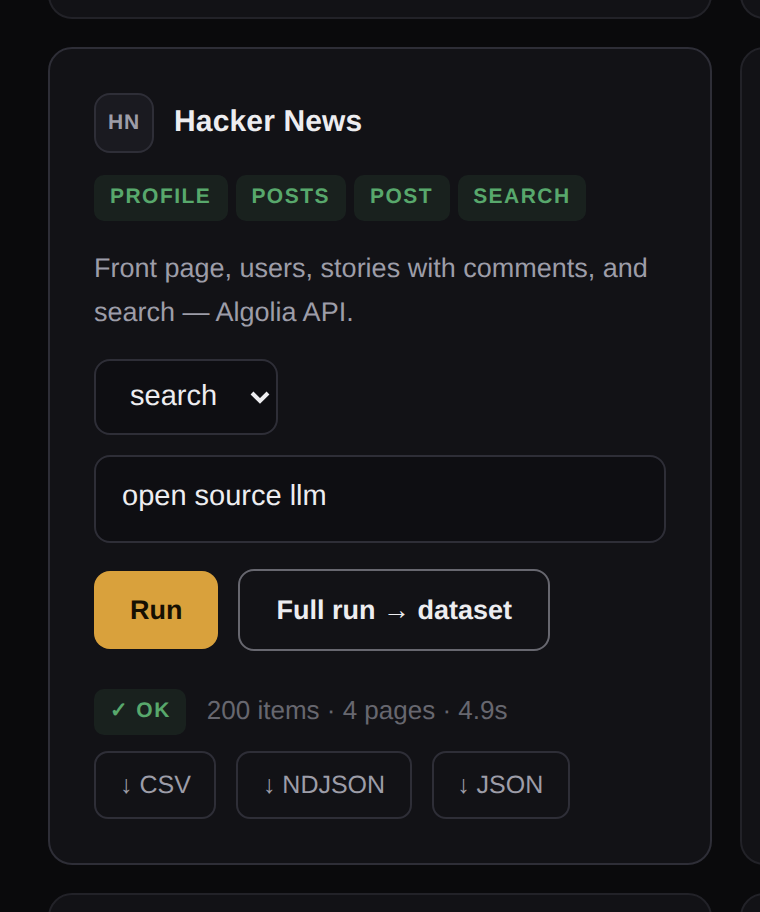
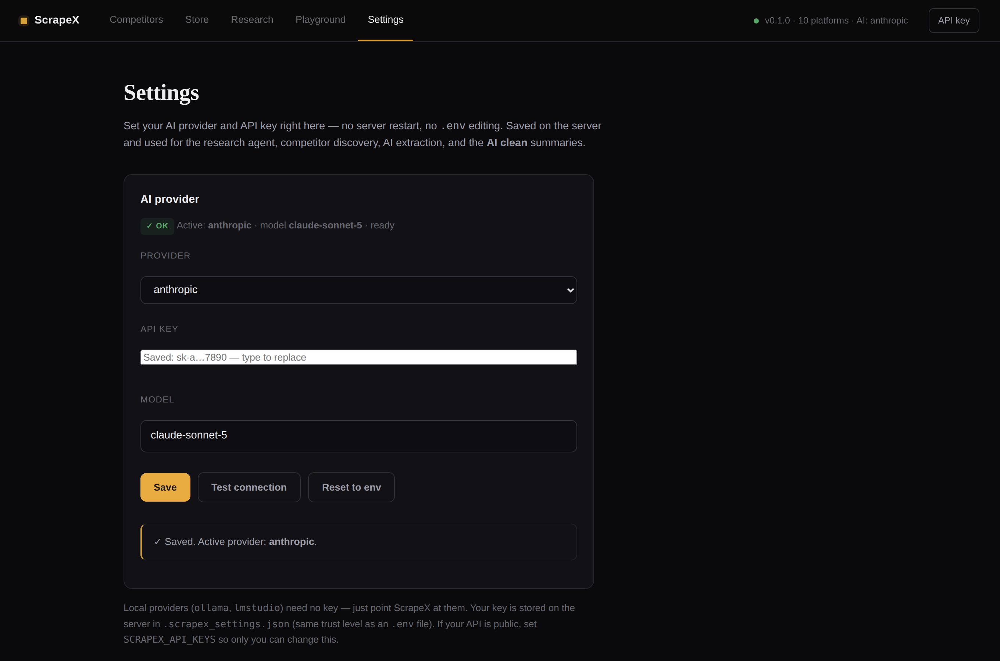
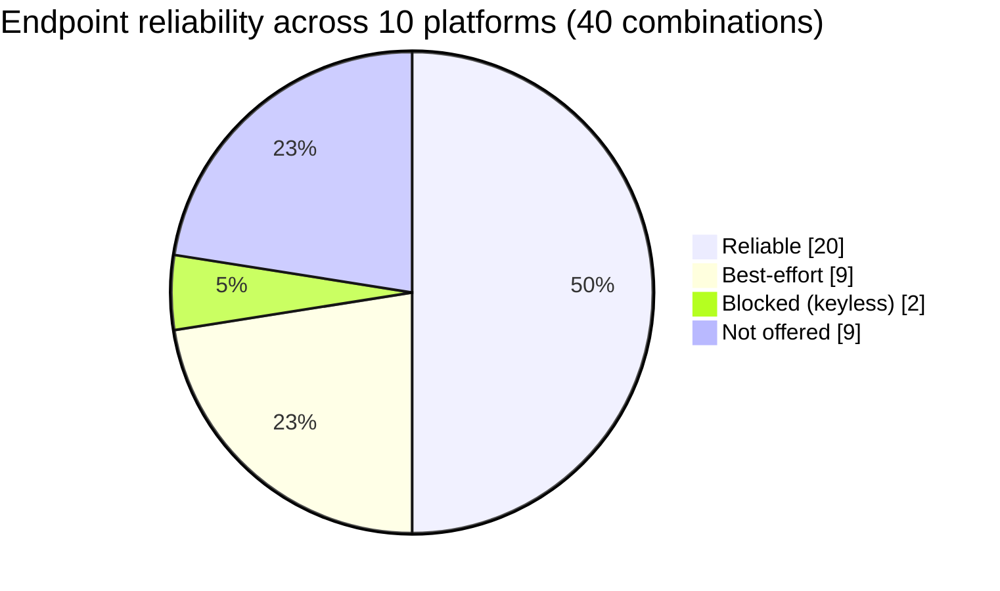
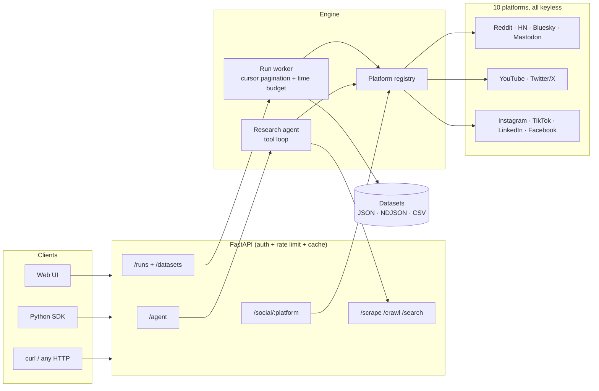
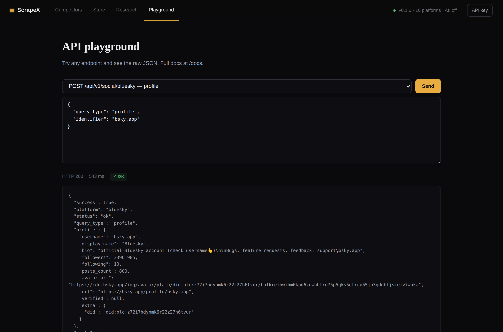

# 🦅 ScrapeX — AI Research Agent for Web & Social Media

<p align="center">
  
  
  
  
  
  
</p>

> **Ask anything about the public web & social — and watch the agent work.** ScrapeX searches the live web and 10 social platforms, reads what matters, and answers with `[n]` citations you can click.

Type a question in the **Ask** box and the agent streams its work in real time — every web search, every page it reads, every platform it queries — then hands back a cited answer. It's a self-hosted, chat-style research agent (think Perplexity, but it can see **Twitter/X, Reddit, YouTube, Bluesky, Hacker News, Mastodon, Instagram, TikTok, LinkedIn, Facebook** too — all keyless, through one unified API).

The pain this solves: keeping a pulse on what the internet is saying — for research, competitor tracking, or brand monitoring — normally means juggling 6 paid scraper APIs, half-dead libraries, and a chatbot that can't cite its sources. ScrapeX is one self-hosted service with **honest status reporting**: when a platform blocks anonymous access you get `status: "blocked"` and an explanation, never fabricated data. Every claim in an answer maps back to a real URL.

---

## 🚀 Quick Start

```bash
npm install scrapx
npx scrapx
# Web UI at http://localhost:8000 — API docs at /docs
```

First run sets up a private Python virtualenv (`~/.scrapx/venv`) and installs dependencies automatically — you just need Python 3.10+ on your `PATH`. Every run after that starts instantly. Pass `--port 3000` or `--host 127.0.0.1` to change how it binds, or install it globally (`npm install -g scrapx` then just run `scrapx`).

Prefer to use ScrapeX **from inside Claude** instead of an HTTP API? `npx scrapx mcp` runs it as an [MCP server](#-mcp-server--use-scrapex-from-claude--any-mcp-client).

**Open http://localhost:8000 in your browser** — ScrapeX ships with a built-in UI (no build step, no Node):

<p align="center">
  
</p>

- **Ask** — the front door. A chat-style research agent: type a question, watch it search the web + social platforms live (each tool call shown with its platform and an honest ✓/⊘ status), and get a cited answer with clickable sources. Works keyless for live search results; add an AI provider in Settings to unlock synthesized answers.
- **Competitors** — type your product, AI discovers the competitors and pulls their social profiles + what Reddit/HN are saying about them. Plus a "track mentions" search across platforms.
- **Store** — an actor-store-style gallery: one card per platform, pick profile/posts/search, run it or start a full dataset run with CSV export. The Profile Finder sits on top.
- **Data Viewer** — every result (Competitors, Store, Runs, or your own pasted JSON) opens here as a readable, sortable table instead of a raw JSON blob — search/filter rows, page through large datasets, click a row for full detail, export CSV/JSON. Describe how you want it cleaned in plain language ("keep only name and email, drop duplicates") and the AI reshapes it in place.
- **AI Studio** — send one prompt straight to your configured model, no tools, to confirm a provider works.
- **Playground** — try every API endpoint with editable request bodies and pretty JSON.

```bash
# Ask the research agent — cited answer as JSON (needs an AI provider key for the answer)
curl -X POST localhost:8000/api/v1/agent \
  -H 'Content-Type: application/json' \
  -d '{"query": "What are developers saying about AI agents this week?"}'

# Same thing, streamed — watch each tool call arrive as a Server-Sent Event
curl -N -X POST localhost:8000/api/v1/agent/stream \
  -H 'Content-Type: application/json' \
  -d '{"query": "What are developers saying about AI agents this week?"}'

# Scrape a YouTube channel — no API key
curl -X POST localhost:8000/api/v1/social/youtube \
  -H 'Content-Type: application/json' \
  -d '{"query_type": "posts", "identifier": "@mkbhd", "limit": 5}'

# One keyword, five platforms, one call
curl -X POST localhost:8000/api/v1/social/search \
  -H 'Content-Type: application/json' \
  -d '{"query": "open source llm", "platforms": ["reddit", "hackernews", "bluesky", "youtube"]}'
```

---

## 🤖 The Research Agent

`POST /api/v1/agent` — the Tavily-style core. The LLM runs a tool loop over ScrapeX's own capabilities (`web_search`, `scrape_url`, `social_search`, `social_posts`), registers every result as a numbered source, and answers with citations that map to real URLs.

```json
{
  "query": "Is the Rust vs Go debate still active?",
  "depth": "advanced",          // "basic" = 3 steps, "advanced" = 8
  "max_sources": 8,
  "include_social": true
}
```

Returns `{answer, sources[], steps[], usage, status}`. The `steps` array is a full trace of what the agent did. Without an AI provider key it degrades to search-only (`status: "no_llm"`) instead of failing.

**`POST /api/v1/agent/stream`** is the same agent as a **Server-Sent Events** stream — this is what powers the **Ask** chat UI. It emits one event per phase: `tool_call` (the agent picked a tool), `tool_result` (it came back, with an `ok`/`blocked`/`partial`/`error` status), `sources`, `answer`, and a terminal `done`. Read it with `fetch()` + a stream reader (it's a POST, so not `EventSource`).

`POST /api/v1/search` also accepts `"include_answer": true` for a one-shot cited answer over web results — the lightweight version of the agent.

---

## 🖥️ Deploy on your own VPS

**Coolify** (or any Nixpacks platform like Railway):

1. New Resource → **Public Repository** → paste `https://github.com/ibrahembuilds/ScrapeX`
2. **Build Pack:** **Nixpacks** — the repo ships a `Procfile` + `nixpacks.toml` with the right start command. The Playwright browser (JS rendering & the TikTok fallback) is skipped by default; add a `playwright install chromium` build step if you need it.
3. **Ports Exposes:** set to **`8000`** — this is the step everyone misses. ScrapeX listens on 8000; if the proxy points at the default 3000 you'll get Traefik's `404 page not found` even though the deploy says Finished.
4. Deploy, then open the domain → the web UI is at `/`, docs at `/docs`, health at `/health`.

Set your env vars (`SCRAPEX_AI_PROVIDER`, `SCRAPEX_AI_API_KEY`, `SCRAPEX_API_KEYS`…) in the platform's Environment tab. If you're exposing the API publicly, set `SCRAPEX_API_KEYS` so auth is enforced.

**Plain VPS, no platform:**

```bash
git clone https://github.com/ibrahembuilds/ScrapeX.git && cd ScrapeX
npx scrapx --host 0.0.0.0 --port 8000
```

Run it under a process manager (`pm2`, `systemd`, `screen`) so it survives logout and restarts on reboot.

---

## 📦 Runs & Datasets — get ALL the data (Apify-style)

The sync `/social` endpoints are built for speed: one page, `limit ≤ 50`, one HTTP request. That's the wrong shape when you want *everything* — a full subreddit listing, 500 HN hits, a whole Bluesky feed. **Runs** fix the limited-time problem the same way Apify does:

1. `POST /api/v1/runs` starts a **background job** — your HTTP request returns immediately, so the scrape is no longer limited by request timeouts.
2. The run **paginates the platform with real cursors** (Reddit `after=`, HN Algolia pages, Bluesky cursors, Mastodon `max_id`) until it has `max_items`, the platform runs out, or the time budget (`SCRAPEX_RUN_TIME_BUDGET`, default 240s) is spent.
3. Every item lands in a **dataset** you can page through and export as **JSON, NDJSON, or CSV**.

```bash
# 1. Start a run — up to 500 items instead of the sync cap of 50
curl -X POST localhost:8000/api/v1/runs -H 'Content-Type: application/json' \
  -d '{"platform": "hackernews", "query_type": "search", "identifier": "llm agents", "max_items": 500}'
# -> {"id": "6c883f636117", "dataset_id": "083f07a8eb4f", "status": "READY", ...}

# 2. Poll until SUCCEEDED (also: TIMED_OUT keeps partial data, FAILED explains why)
curl localhost:8000/api/v1/runs/6c883f636117

# 3. Export the dataset — pick your format
curl "localhost:8000/api/v1/datasets/083f07a8eb4f/items?offset=0&limit=100"   # JSON envelope
curl "localhost:8000/api/v1/datasets/083f07a8eb4f/items?format=ndjson"        # 1 item per line
curl "localhost:8000/api/v1/datasets/083f07a8eb4f/items?format=csv" -o out.csv
```

How a run flows through the system:



Run lifecycle — every terminal state keeps whatever data was already collected:



Cursor pagination is implemented natively for **Reddit, Hacker News, Bluesky, and Mastodon** today; other platforms serve a single (still deduped) page per run. Verified live: 150 HN items in 5.2s, 120 Reddit posts in 5.7s, 120 Bluesky posts in 3.7s, 90 Mastodon statuses in 7.2s — all past the old 50-item ceiling.

**Runs, datasets, and schedules survive restarts.** Everything is persisted to SQLite (`SCRAPEX_DB_FILE`, default `.scrapex_data.sqlite3` — no database server to run). Restart the server and your run history and collected datasets are still there; a run that was mid-flight during the restart is honestly marked `ABORTED` with its partial data kept, never left hanging in `RUNNING`. Set `SCRAPEX_DB_FILE=""` for the old memory-only behavior.

**Webhooks** — add `"webhook_url": "https://your-app/hook"` to any run (or schedule) and ScrapeX POSTs a `run.finished` event there when the run reaches a terminal state, with the final run status and a pointer to the dataset. Failed deliveries never fail the run.

### ⏰ Schedules — recurring scrapes

The missing Apify feature: **"scrape this every N minutes."** A schedule is a stored run that re-fires on an interval — each firing is a normal dataset run, so everything above (pagination, datasets, exports, webhooks) applies.

```bash
# Track HN chatter about "llm agents" every hour, 200 items per snapshot,
# and ping my app when each snapshot lands:
curl -X POST localhost:8000/api/v1/schedules -H 'Content-Type: application/json' \
  -d '{"platform": "hackernews", "query_type": "search", "identifier": "llm agents",
       "interval_minutes": 60, "max_items": 200, "run_immediately": true,
       "webhook_url": "https://my-app.example/scrapex-hook", "name": "hn llm watch"}'

curl localhost:8000/api/v1/schedules                    # list (next_run_at, runs_started, last_run_id)
curl -X POST localhost:8000/api/v1/schedules/ID/pause   # stop firing (resume brings it back)
curl -X POST localhost:8000/api/v1/schedules/ID/run     # fire one run right now, off-cadence
curl -X DELETE localhost:8000/api/v1/schedules/ID
```

Schedules are persisted too — restart the server and they keep firing. If the server was down through a slot, the schedule fires once on the next tick and resumes its cadence (no burst of make-up runs).

---

## 🔌 MCP Server — use ScrapeX from Claude & any MCP client

ScrapeX doubles as a **Model Context Protocol server**: one command exposes web search, page scraping, all 10 social platforms, the profile finder, dataset runs, and the research agent as native tools inside Claude Desktop, Claude Code, Cursor, or any MCP client.

```bash
# Claude Code
claude mcp add scrapex -- npx scrapx mcp

# Claude Desktop — add to claude_desktop_config.json:
{"mcpServers": {"scrapex": {"command": "npx", "args": ["scrapx", "mcp"]}}}
```

Then just ask Claude things like *"check what r/selfhosted thinks about Coolify this week"* or *"find the username 'mkbhd' on every platform"* — it picks the right ScrapeX tool.

| Tool | What it does |
|---|---|
| `scrapex_web_search` | Live web search (DDG → Startpage), keyless |
| `scrapex_scrape_url` | Any page → clean markdown + links |
| `scrapex_social` | One platform: profile / posts / post / search |
| `scrapex_social_search` | One keyword across platforms, concurrently |
| `scrapex_find_profiles` | A username checked on every platform at once |
| `scrapex_research` | The full cited research agent (needs an AI key) |
| `scrapex_start_run` / `scrapex_get_run` / `scrapex_dataset_items` | Apify-style dataset runs, right from chat |

The MCP server calls the scraping engine **in-process** — the HTTP server doesn't need to be running. It shares the same SQLite store, so a dataset run started from Claude shows up in the web UI and vice versa. (Self-hosting from source: `python -m app.mcp_server`.)

---

## 🏪 Scraper Store & Profile Finder

Open **http://localhost:8000 → Store**: an Apify-store-style gallery, but built in, self-hosted, and free. One card per platform showing exactly what it can do (reliability badges come live from `/health`). Pick **profile / posts / post / search**, drop in a username or query, and either:

- **Run** — instant result in the card (profile stats, latest posts, raw JSON), or
- **Full run → dataset** — a background run with cursor pagination (up to 200 items from the UI) and one-click **CSV / NDJSON / JSON** download when it finishes.

<p align="center">
  
</p>

At the top of the Store sits the **Profile Finder** — type just a username and ScrapeX checks **every profile-capable platform concurrently** and tells you where that handle exists and what its public profile says:

```bash
curl -X POST localhost:8000/api/v1/profiles/find \
  -H 'Content-Type: application/json' \
  -d '{"username": "mkbhd"}'
# -> {"found": ["bluesky", "instagram", "tiktok", "twitter", "youtube"],
#     "checked": [... 9 platforms ...],
#     "results": {"youtube": {"profile": {"followers": 19900000, ...}}, ...}}
```

Scope it with `"platforms": ["twitter", "youtube"]` to check only what you care about. Platforms that block anonymous lookups (LinkedIn, Facebook) are reported honestly in `results` rather than silently dropped.

---

## 🔎 Data Viewer — see and clean your data

Raw JSON is fine for scripts, not for eyeballing 50 rows of scraped posts. Every place that produces a list of results (a Store run, a full dataset run, Competitors, Profile Finder, or the Playground) has a **"View in Data Viewer"** button. Click it and the Data Viewer tab opens with:

- A **table** (auto-generated columns, click any row for full detail) or **cards** view, plus **Raw JSON** for the exact payload.
- A **filter box** that searches across every field, and pagination for large datasets.
- A **prompt box**: describe how you want the data cleaned — *"keep only name, email and bio; remove duplicates; one row per person"* — and `POST /api/v1/clean` sends it to your configured AI, which reshapes/filters/dedupes the rows in place (never inventing data that wasn't there). No AI configured? It still deterministically tidies (HTML stripped, empty fields dropped).
- **Reset to original**, and **CSV / JSON export** of whatever's currently loaded.
- **Paste JSON…** to load and clean data you already have, independent of any scrape.

```bash
curl -X POST localhost:8000/api/v1/clean \
  -H 'Content-Type: application/json' \
  -d '{"items": [{"name": "Ada Lovelace", "note": "  math <b>pioneer</b>  "}], "prompt": "strip html and trim whitespace"}'
```

---

## 🧠 Bring Your Own AI

Every AI feature (research agent, competitor discovery, `/extract`, search answers, AI Studio, AI-clean summaries) runs on **whatever LLM you plug in** — cloud or fully local.

**Easiest: set it in the app.** Open the web UI → **Settings** tab, pick a provider, paste your API key, pick a model from the dropdown, Save. No env vars, no restart, no guessing a model ID — every provider ships a curated, up-to-date list of models to choose from (with a "Custom model ID…" escape hatch for anything not listed). It takes effect immediately and persists on the server.

<p align="center">
  
</p>

Prefer env vars? Those still work too:

```bash
SCRAPEX_AI_PROVIDER=anthropic
SCRAPEX_AI_API_KEY=sk-ant-...
```

(A key set in the Settings tab overrides the env var; "Reset to env" in the tab drops it again.)

| Provider | `SCRAPEX_AI_PROVIDER` | Key needed | Default `SCRAPEX_AI_MODEL` |
|---|---|:--:|---|
| OpenRouter (default) | `openrouter` | ✅ | `anthropic/claude-sonnet-5` |
| Anthropic | `anthropic` | ✅ | `claude-sonnet-5` |
| OpenAI | `openai` | ✅ | `gpt-5.4-mini` |
| DeepSeek | `deepseek` | ✅ | `deepseek-v4-flash` |
| xAI / Grok | `xai` or `grok` | ✅ | `grok-4.3` |
| Groq | `groq` | ✅ | `openai/gpt-oss-20b` |
| Mistral | `mistral` | ✅ | `mistral-large-latest` |
| **Ollama (local, free)** | `ollama` | ❌ | `llama3.1:8b` |
| **LM Studio (local, free)** | `lmstudio` | ❌ | whatever you loaded |
| Anything else (vLLM, llama.cpp, LiteLLM…) | `custom` + `SCRAPEX_AI_BASE_URL` | optional | your model id |

They all speak the OpenAI chat-completions dialect, so one client covers every row. `GET /health` shows which brain is currently plugged in (`"ai": {"provider": ..., "model": ..., "enabled": ...}`) — the web UI displays it in the header. The old `SCRAPEX_OPENROUTER_API_KEY` still works unchanged. `GET /api/v1/settings/ai` also returns each provider's curated model list under `providers.<name>.models` — that's what powers the Settings dropdown, and it's just as usable from a script.

### AI Studio — confirm it's actually working

Open the web UI → **AI Studio** tab (or `POST /api/v1/ai/studio`) to send one prompt straight to your configured provider — no tools, no agent loop, just a direct round trip. It's the fastest way to confirm a provider/API key/model combination actually works before pointing the research agent or competitor discovery at it, and to try a model from the picker before committing to it in Settings.

```bash
curl -X POST localhost:8000/api/v1/ai/studio \
  -H 'Content-Type: application/json' \
  -d '{"prompt": "Say hello in one sentence.", "temperature": 0.7}'
```

### Clean output — pass results through the AI before they come out

Add `"clean": true` to any `/social/{platform}` call, `/social/search`, or a dataset run and the output goes through a two-stage pipeline before it reaches you:

1. **Tidy (always, no AI needed)** — leftover HTML stripped, whitespace collapsed, runaway text capped, empty fields and the noisy raw `data[]` payloads dropped. What's left is just readable posts and profiles.
2. **AI pass (when a provider is configured)** — the tidied content is summarized into a plain-language `summary`: 3–5 bullets of what the posts are saying, a 2-sentence profile description, or an overview of a whole dataset run. In `/social/search` you get **one summary across all platforms**.

```bash
curl -X POST localhost:8000/api/v1/social/reddit \
  -H 'Content-Type: application/json' \
  -d '{"query_type": "posts", "identifier": "python", "limit": 10, "clean": true}'
# -> posts are tidy, data[] is empty, and "summary" reads like a human wrote it
```

No provider configured? `clean` still tidies everything — `summary` is simply `null`. A failed summary never breaks a scrape. In the Store, every card has an **AI clean** toggle that does the same thing.

### What computer can run it?

ScrapeX itself is featherweight — the heavy question is only the **local** LLM, if you choose one:

| What you run | CPU | RAM | Notes |
|---|---|---|---|
| ScrapeX API alone (cloud or no AI) | 1 vCPU | **512 MB – 1 GB** | Runs on a $5 VPS or Raspberry Pi 4 |
| + Playwright (JS rendering, TikTok fallback) | 2 vCPU | **+1 GB** | Headless Chromium is the hungry part |
| + Ollama `llama3.2:3b` | 4 cores | **8 GB** | Any modern laptop; fine for extraction/answers |
| + Ollama `llama3.1:8b` / `qwen2.5:7b` | 4–8 cores | **16 GB** | Sweet spot — good agent tool-calling; M1/M2 Mac or mid PC |
| + Ollama `qwen2.5:14b` | 8 cores | **32 GB** | Noticeably better reasoning |
| + Ollama `llama3.3:70b` | 16 cores / GPU | **64 GB+** (or 2×24 GB GPU) | Server class; near-cloud quality |

Rule of thumb: a Q4-quantized model needs roughly **RAM ≈ parameters × 0.75 GB** plus headroom — and models at 7B+ handle the agent's tool-calling loop much more reliably than 3B ones.

---

## 📱 Social Platform Support (honest matrix)

Every platform speaks the same request shape via `POST /api/v1/social/{platform}`:

```json
{"query_type": "profile | posts | post | search", "identifier": "...", "limit": 10, "options": {}}
```

| Platform | profile | posts | post | search | Strategy (all keyless) |
|---|:--:|:--:|:--:|:--:|---|
| **Bluesky** | ✅ | ✅ | ✅ | ✅ | Official public AppView API |
| **Hacker News** | ✅ | ✅ | ✅ + comments | ✅ | Official Algolia API |
| **YouTube** | ✅ | ✅ | ✅ | ✅ | Innertube (YouTube's own JSON API) |
| **Reddit** | — | ✅ | ✅ + comments | ✅ | old.reddit.com HTML |
| **Mastodon** | ✅ | ✅ | ✅ | 🟡 | Instance REST API; search auth-gated on big instances → hashtag fallback |
| **Twitter/X** | ✅ | 🚫* | ✅ | 🚫* | fxtwitter → vxtwitter → syndication CDN chain |
| **Instagram** | 🟡 | 🟡 | 🟡 | — | web profile API + embed pages; rate-limits datacenter IPs |
| **TikTok** | 🟡 | 🟡† | 🟡 | — | embedded page JSON; Playwright fallback |
| **LinkedIn** | 🟡 | — | — | — | og:/meta salvage; login wall reported honestly |
| **Facebook** | 🟡 | — | — | — | og:/meta salvage; login wall reported honestly |

✅ reliable · 🟡 best-effort (may return `status: "partial"` or `"blocked"` with an explanation) 
\* Twitter timelines/search have no reliable keyless source since Nitter died; single tweets & profiles work great. Point `SCRAPEX_NITTER_INSTANCES` at a live mirror to re-enable them.
† TikTok video lists need JS hydration — works where Playwright can run.

Every response includes `status` (`ok | partial | blocked | error`), `source` (which strategy served it), normalized `posts[]`/`profile`, and the raw payload in `data[]`. Check `GET /health` for the capability matrix, or `GET /health?probe=true` for **live** platform reachability from your server.

### LinkedIn & Instagram — bring your own session cookie

Anonymous requests to these two are blocked almost completely by design (confirmed live: LinkedIn returns its HTTP 999 bot-block, Instagram rate-limits/redirects to login) — that's not a bug ScrapeX can parse around. What actually works is the same thing a signed-in browser tab does: send the request with **your own logged-in session cookie**.

Open **Settings → Session cookies** in the web UI (or `POST /api/v1/settings/cookies`) and paste:

- **LinkedIn**: the `li_at` cookie — DevTools → Application/Storage → Cookies → `linkedin.com` → `li_at`.
- **Instagram**: the `sessionid` cookie (and optionally `csrftoken`) — DevTools → Cookies → `instagram.com` → `sessionid`.

With a cookie set, requests go out authenticated as you instead of hitting the wall — LinkedIn also falls back to a cookie-carrying Playwright render when the plain HTTP fetch is still walled. No cookie configured → unchanged best-effort og:/meta-tag behavior, same as before. These are your own account's credentials, stored server-side with the same trust model as the AI API key — treat them like a password (`SCRAPEX_LINKEDIN_COOKIE` / `SCRAPEX_INSTAGRAM_SESSIONID` / `SCRAPEX_INSTAGRAM_CSRFTOKEN` env vars work too).

The same matrix as a picture — of the 40 platform × endpoint combinations, half are fully reliable and only 2 are hard-blocked (Twitter timelines/search, until you point `SCRAPEX_NITTER_INSTANCES` at a live mirror):



---

## 🗺️ Architecture



---

## 📡 API

<p align="center">
  
</p>

| Method | Endpoint | Description |
|--------|----------|-------------|
| `GET` | `/` | 🆕 Built-in web UI (competitors, research, playground) |
| `POST` | `/api/v1/competitors` | 🆕 Discover a product's competitors + their socials & mentions |
| `POST` | `/api/v1/agent` | 🆕 Research agent → cited answer + sources + trace |
| `POST` | `/api/v1/social/{platform}` | 🆕 Unified social scraping (10 platforms) |
| `POST` | `/api/v1/social/search` | 🆕 One keyword across many platforms, concurrently |
| `POST` | `/api/v1/runs` | 🆕 Start an Apify-style dataset run (paginate until `max_items`) |
| `GET` | `/api/v1/runs`, `/api/v1/runs/{id}` | 🆕 List runs / poll run status |
| `POST` | `/api/v1/runs/{id}/abort` | 🆕 Abort a running job (keeps collected items) |
| `GET` | `/api/v1/datasets/{id}/items` | 🆕 Page/export a dataset (`format=json\|ndjson\|csv`) |
| `POST`/`GET` | `/api/v1/schedules` | 🆕 Recurring runs — "scrape this every N minutes" |
| `POST` | `/api/v1/schedules/{id}/pause`, `/resume`, `/run` | 🆕 Pause / resume / fire a schedule now |
| `DELETE` | `/api/v1/schedules/{id}` | 🆕 Delete a schedule |
| `POST` | `/api/v1/profiles/find` | 🆕 Find a username across every platform at once |
| `GET`/`POST` | `/api/v1/settings/ai` | 🆕 Read/set the AI provider, key & model at runtime (also `/settings/ai/test`, `/clear`) |
| `POST` | `/api/v1/ai/studio` | 🆕 Send one prompt straight to the configured AI — no tools, no agent loop |
| `POST` | `/api/v1/search` | Web search (DDG → Startpage fallback), optional AI answer |
| `POST` | `/api/v1/scrape` | Scrape any URL → clean markdown, metadata, links |
| `POST` | `/api/v1/crawl` | Crawl a site (background job) |
| `GET` | `/api/v1/crawl/{id}` | Crawl job status |
| `POST` | `/api/v1/extract` | AI structured extraction from any page |
| `POST` | `/api/v1/social/twitter`, `/social/reddit` | Legacy endpoints (still work, old body shapes accepted) |
| `GET` | `/health` | Health + platform capability matrix (`?probe=true` for live probes) |

---

## 🐍 Python SDK

```python
from scrapex import ScrapeX

client = ScrapeX(base_url="http://localhost:8000")  # api_key="sx-..." if auth is enabled

# Research agent
r = client.agent("What are people saying about the latest Claude release?", depth="advanced")
print(r["answer"])          # markdown with [1][2] citations
print(r["sources"])         # the URLs behind those citations

# AI Studio — one prompt, straight to whatever provider you've configured
reply = client.studio("Say hello in one sentence.")
print(reply["reply"], reply["model"])

# Competitor discovery + analysis
report = client.competitors("Notion (note-taking app)")
for c in report["competitors"]:
    print(c["name"], c["website"], c["profiles"].get("twitter", {}).get("followers"))

# Unified social API
profile = client.social("bluesky", "profile", "bsky.app")
videos  = client.social("youtube", "posts", "@mkbhd", limit=5)
tweet   = client.social("twitter", "post", "https://x.com/jack/status/20")
top     = client.social("reddit", "posts", "python", listing="top")
tidy    = client.social("reddit", "posts", "python", clean=True)  # tidy + AI summary

# Profile Finder — one username, every platform
who = client.find_profiles("mkbhd")
print(who["found"])          # ["bluesky", "twitter", "youtube", ...]
print(who["results"]["youtube"]["profile"]["followers"])

# Cross-platform search
hits = client.social_search("ai agents", platforms=["reddit", "hackernews", "bluesky"])

# Get ALL the data — Apify-style run -> dataset (no 50-item cap)
run   = client.run_social("hackernews", "search", "llm agents", max_items=500)
run   = client.wait_for_run(run["id"])
items = client.dataset_all_items(run["dataset_id"])          # every item
csv_  = client.dataset_items(run["dataset_id"], format="csv")  # or export

# Recurring scrapes — fire the same run every hour, webhook on each finish
sched = client.create_schedule("hackernews", "search", "llm agents",
                               interval_minutes=60, max_items=200,
                               webhook_url="https://my-app.example/hook",
                               run_immediately=True)
client.pause_schedule(sched["id"]); client.resume_schedule(sched["id"])

# Web search with AI answer
result = client.search("best vector databases 2026", include_answer=True)

# Classic scraping still here
page = client.scrape("https://books.toscrape.com")
data = client.extract("https://books.toscrape.com", "book titles and prices as JSON")
```

---

## ⚙️ Configuration

All via `.env` (copy from `.env.example`), prefix `SCRAPEX_`:

| Variable | Default | What it does |
|----------|---------|---------------|
| `SCRAPEX_AI_PROVIDER` | `openrouter` | Which AI to use: `anthropic`, `openai`, `deepseek`, `xai`, `groq`, `mistral`, `ollama`, `lmstudio`, `custom`, … |
| `SCRAPEX_AI_API_KEY` | — | Key for the chosen provider (not needed for local ones) |
| `SCRAPEX_AI_BASE_URL` | preset | Endpoint override; required for `provider=custom` |
| `SCRAPEX_OPENROUTER_API_KEY` | — | Legacy name — still works ([free key](https://openrouter.ai/keys)) |
| `SCRAPEX_AI_MODEL` | per provider | Model for extraction/answers |
| `SCRAPEX_AGENT_MODEL` | falls back to `AI_MODEL` | Model for the research agent (needs tool-calling) |
| `SCRAPEX_AGENT_MAX_STEPS` | `8` | Tool-loop budget for `depth: "advanced"` |
| `SCRAPEX_API_KEYS` | — | Comma-separated keys; **auth is enforced only when set** (Bearer or `X-API-Key`) |
| `SCRAPEX_RATE_LIMIT_REQUESTS` | `60` | Requests/minute per client IP (in-process) |
| `SCRAPEX_CACHE_TTL` | `300` | Seconds to cache social responses |
| `SCRAPEX_SOCIAL_TIMEOUT` | `20` | Per-platform timeout (s) |
| `SCRAPEX_RUN_TIME_BUDGET` | `240` | Seconds a dataset run may spend paginating |
| `SCRAPEX_RUN_MAX_ITEMS` | `1000` | Hard cap on `max_items` per run |
| `SCRAPEX_RUN_PAGE_DELAY` | `0.5` | Politeness delay between pages in a run |
| `SCRAPEX_DB_FILE` | `.scrapex_data.sqlite3` | SQLite file for runs/datasets/schedules; `""` = memory-only |
| `SCRAPEX_SCHEDULER_POLL_INTERVAL` | `10` | Seconds between due-schedule checks |
| `SCRAPEX_WEBHOOK_TIMEOUT` | `10` | Seconds for `run.finished` webhook deliveries |
| `SCRAPEX_SETTINGS_FILE` | `.scrapex_settings.json` | Where the Settings tab persists runtime AI config |
| `SCRAPEX_NITTER_INSTANCES` | — | Comma-separated Nitter mirrors for Twitter timelines |
| `SCRAPEX_PROXY_URL` | — | Outbound proxy for scraping |
| `SCRAPEX_DEBUG` | `false` | Verbose logging |

---

## 🆚 vs Firecrawl / Tavily

| | Firecrawl | Tavily | **ScrapeX** |
|---|:--:|:--:|:--:|
| Web scraping + JS rendering | ✅ | ❌ | ✅ |
| Site crawling | ✅ | ❌ | ✅ |
| AI extraction | ✅ | ❌ | ✅ |
| Search with cited AI answer | ❌ | ✅ | ✅ |
| Research agent (tool loop + trace) | 🟡 | 🟡 | ✅ |
| **Social media (10 platforms)** | ❌ | ❌ | ✅ |
| Apify-style dataset runs (JSON/NDJSON/CSV export) | 🟡 | ❌ | ✅ |
| Scheduled recurring scrapes + webhooks | 🟡 | ❌ | ✅ |
| Built-in MCP server (use it from Claude/Cursor) | 🟡 | 🟡 | ✅ |
| Cross-platform profile finder | ❌ | ❌ | ✅ |
| Bring your own AI (incl. free local Ollama) | ❌ | ❌ | ✅ |
| Honest per-platform status | — | — | ✅ |
| Price | $19–$249/mo | $30+/mo | **Free & self-hosted** |

---

## 🧪 Development

Working on ScrapeX itself (not just running it)? Skip the `scrapx` CLI and use the source directly:

```bash
pip install -r requirements.txt -r requirements-dev.txt
pytest -q                              # 150 tests, no network needed
python scripts/verify_platforms.py    # live smoke test from YOUR egress IP
uvicorn app.main:app --reload
```

CI runs the test suite on every push/PR (`.github/workflows/ci.yml`). The live verify script matters because scraping reliability depends on your server's IP reputation — run it after deploying.

### A note on honesty

Platforms fight scrapers. Anything marked 🟡 can break or get rate-limited without notice — when that happens ScrapeX tells you (`status`, `error`) rather than returning stale or fake data. Responses are cached (default 5 min) to keep your footprint small. Scrape responsibly and respect each platform's terms.

## 📦 Project Structure

```
ScrapeX/
├── bin/scrapx.js                # npm CLI (`npx scrapx` serve / `npx scrapx mcp`) — bootstraps a venv
├── package.json                 # npm package "scrapx"
├── app/
│   ├── main.py                  # FastAPI app, auth, rate limiting, lifespan (scheduler)
│   ├── mcp_server.py            # MCP server (stdio) — ScrapeX tools for Claude/Cursor/...
│   ├── config.py                # Settings (SCRAPEX_* env vars)
│   ├── auth.py                  # Optional API-key auth
│   ├── routes/
│   │   ├── agent.py             # /agent — research agent
│   │   ├── scrape.py            # /scrape, /crawl, /search
│   │   ├── social.py            # /social/{platform}, /social/search
│   │   ├── datasets.py          # /runs, /datasets — Apify-style jobs & exports
│   │   ├── schedules.py         # /schedules — recurring runs
│   │   ├── profiles.py          # /profiles/find — username across all platforms
│   │   ├── settings.py          # /settings/ai — set the AI provider/key/model from the UI
│   │   ├── ai_studio.py         # /ai/studio — one-off prompt/response console
│   │   └── extract.py, health.py
│   ├── services/
│   │   ├── agent.py             # ResearchAgent tool loop
│   │   ├── store.py             # SQLite persistence (runs/datasets/schedules)
│   │   ├── scheduler.py         # recurring-run scheduler loop
│   │   ├── ai_provider.py       # bring-your-own-AI: anthropic/openai/.../ollama/custom + model catalog
│   │   ├── ai_studio.py         # single-shot prompt runner behind /ai/studio
│   │   ├── ai_cleaner.py        # clean pipeline: tidy + AI summary (clean=true)
│   │   ├── runtime_settings.py  # UI-set overrides persisted to .scrapex_settings.json
│   │   ├── datasets.py          # run worker: cursor pagination, time budget, dedupe
│   │   ├── search.py            # DDG → Startpage search chain
│   │   ├── social_base.py       # SocialPlatform base (cache, degradation, fetch_page)
│   │   ├── social_registry.py   # platform name → service
│   │   ├── twitter.py, reddit.py, youtube.py, bluesky.py,
│   │   ├── hackernews.py, mastodon.py, instagram.py, tiktok.py,
│   │   ├── linkedin_facebook.py
│   │   ├── scraper.py, browser.py, ai_extractor.py, cache.py, net.py
│   └── models/                  # Pydantic schemas
├── sdk/python/scrapex/          # Python client
├── scripts/verify_platforms.py  # live smoke test
└── tests/                       # pytest suite (mocked HTTP)
```

## 📄 License

MIT — free for personal and commercial use.

---

Built with ❤️ by [KanyouAI](https://kanyouai.com)
