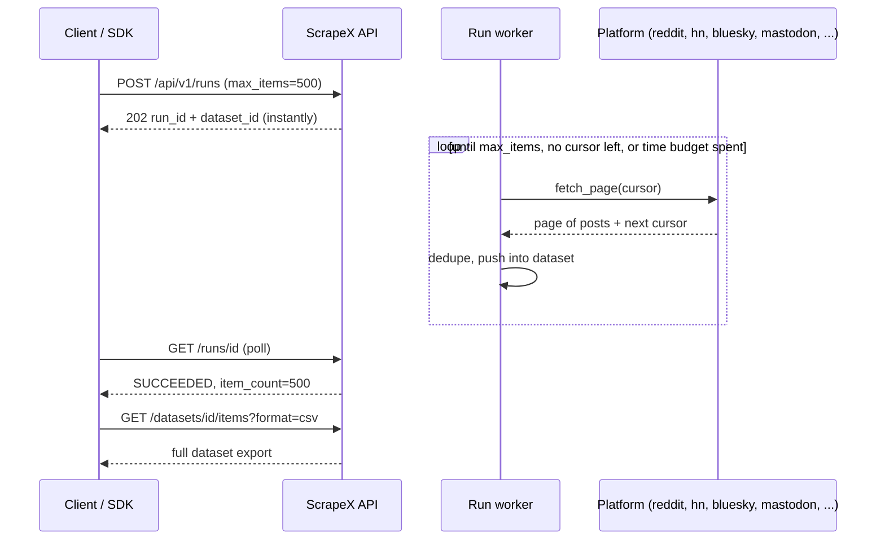
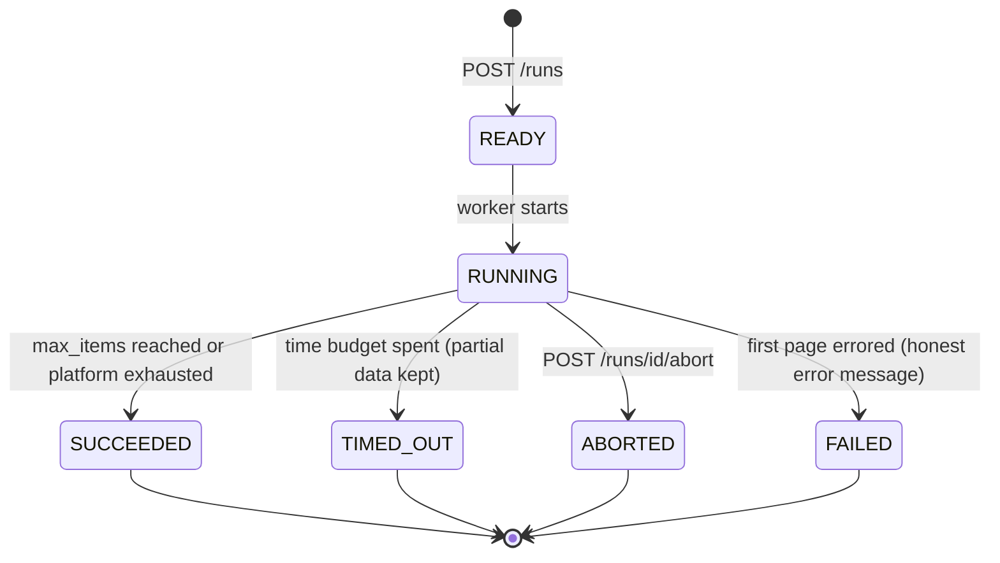
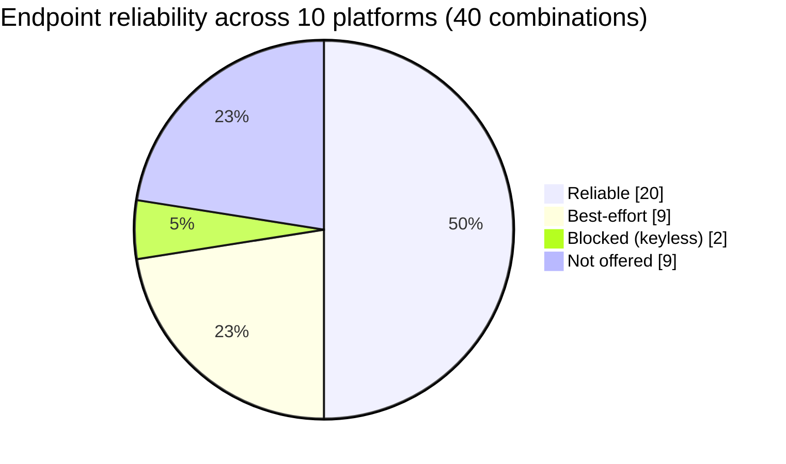
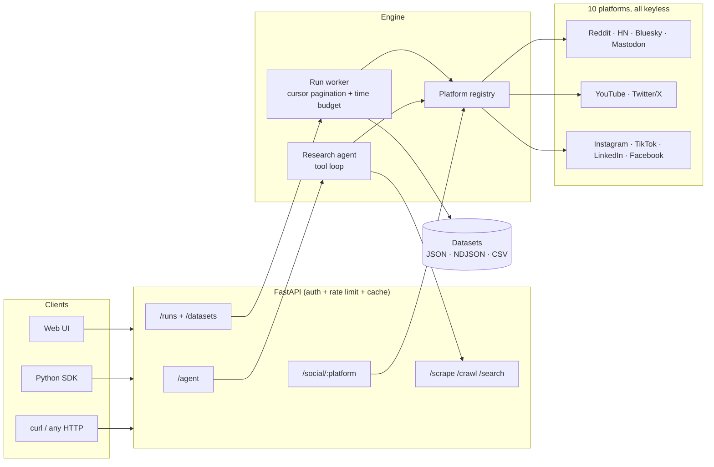

# 🦅 ScrapeX — AI Research Agent for Web & Social Media

<p align="center">
  
  
  
  
  
</p>

> **One API for public web & social data — plus a Tavily-style research agent that turns questions into cited answers.**

Ask a question → the agent searches the web and social platforms, scrapes what matters, and returns a markdown answer with `[n]` citations. Or hit the platforms directly: **Twitter/X, Reddit, YouTube, Bluesky, Hacker News, Mastodon, Instagram, TikTok, LinkedIn, Facebook** — all keyless, all through one unified endpoint.

The pain this solves: getting public web + social data normally means juggling 6 paid scraper APIs, half-dead libraries, and brittle scripts. ScrapeX is one self-hosted API with **honest status reporting** — when a platform blocks anonymous access, you get `status: "blocked"` and an explanation, never fabricated data.

---

## 🚀 Quick Start

```bash
git clone https://github.com/hemoyt/ScrapeX.git && cd ScrapeX
docker compose up -d
# Web UI at http://localhost:8000 — API docs at /docs
```

**Open http://localhost:8000 in your browser** — ScrapeX ships with a built-in UI (no build step, no Node):

- **Competitors** — type your product, AI discovers the competitors and pulls their social profiles + what Reddit/HN are saying about them. Plus a "track mentions" search across platforms.
- **Research** — ask a question, get a cited answer with sources and the agent's full tool trace.
- **Playground** — try every API endpoint with editable request bodies and pretty JSON.

```bash
# Ask the research agent (needs a free OpenRouter key for answers)
curl -X POST localhost:8000/api/v1/agent \
  -H 'Content-Type: application/json' \
  -d '{"query": "What are developers saying about AI agents this week?"}'

# Scrape a YouTube channel — no API key
curl -X POST localhost:8000/api/v1/social/youtube \
  -H 'Content-Type: application/json' \
  -d '{"query_type": "posts", "identifier": "@mkbhd", "limit": 5}'

# One keyword, five platforms, one call
curl -X POST localhost:8000/api/v1/social/search \
  -H 'Content-Type: application/json' \
  -d '{"query": "open source llm", "platforms": ["reddit", "hackernews", "bluesky", "youtube"]}'
```

---

## 🤖 The Research Agent

`POST /api/v1/agent` — the Tavily-style core. The LLM runs a tool loop over ScrapeX's own capabilities (`web_search`, `scrape_url`, `social_search`, `social_posts`), registers every result as a numbered source, and answers with citations that map to real URLs.

```json
{
  "query": "Is the Rust vs Go debate still active?",
  "depth": "advanced",          // "basic" = 3 steps, "advanced" = 8
  "max_sources": 8,
  "include_social": true
}
```

Returns `{answer, sources[], steps[], usage, status}`. The `steps` array is a full trace of what the agent did. Without an OpenRouter key it degrades to search-only (`status: "no_llm"`) instead of failing.

`POST /api/v1/search` also accepts `"include_answer": true` for a one-shot cited answer over web results — the lightweight version of the agent.

---

## 📦 Runs & Datasets — get ALL the data (Apify-style)

The sync `/social` endpoints are built for speed: one page, `limit ≤ 50`, one HTTP request. That's the wrong shape when you want *everything* — a full subreddit listing, 500 HN hits, a whole Bluesky feed. **Runs** fix the limited-time problem the same way Apify does:

1. `POST /api/v1/runs` starts a **background job** — your HTTP request returns immediately, so the scrape is no longer limited by request timeouts.
2. The run **paginates the platform with real cursors** (Reddit `after=`, HN Algolia pages, Bluesky cursors, Mastodon `max_id`) until it has `max_items`, the platform runs out, or the time budget (`SCRAPEX_RUN_TIME_BUDGET`, default 240s) is spent.
3. Every item lands in a **dataset** you can page through and export as **JSON, NDJSON, or CSV**.

```bash
# 1. Start a run — up to 500 items instead of the sync cap of 50
curl -X POST localhost:8000/api/v1/runs -H 'Content-Type: application/json' \
  -d '{"platform": "hackernews", "query_type": "search", "identifier": "llm agents", "max_items": 500}'
# -> {"id": "6c883f636117", "dataset_id": "083f07a8eb4f", "status": "READY", ...}

# 2. Poll until SUCCEEDED (also: TIMED_OUT keeps partial data, FAILED explains why)
curl localhost:8000/api/v1/runs/6c883f636117

# 3. Export the dataset — pick your format
curl "localhost:8000/api/v1/datasets/083f07a8eb4f/items?offset=0&limit=100"   # JSON envelope
curl "localhost:8000/api/v1/datasets/083f07a8eb4f/items?format=ndjson"        # 1 item per line
curl "localhost:8000/api/v1/datasets/083f07a8eb4f/items?format=csv" -o out.csv
```

How a run flows through the system:



Run lifecycle — every terminal state keeps whatever data was already collected:



Cursor pagination is implemented natively for **Reddit, Hacker News, Bluesky, and Mastodon** today; other platforms serve a single (still deduped) page per run. Verified live: 150 HN items in 5.2s, 120 Reddit posts in 5.7s, 120 Bluesky posts in 3.7s, 90 Mastodon statuses in 7.2s — all past the old 50-item ceiling.

---

## 🏪 Scraper Store & Profile Finder

Open **http://localhost:8000 → Store**: an Apify-store-style gallery, but built in, self-hosted, and free. One card per platform showing exactly what it can do (reliability badges come live from `/health`). Pick **profile / posts / post / search**, drop in a username or query, and either:

- **Run** — instant result in the card (profile stats, latest posts, raw JSON), or
- **Full run → dataset** — a background run with cursor pagination (up to 200 items from the UI) and one-click **CSV / NDJSON / JSON** download when it finishes.

At the top of the Store sits the **Profile Finder** — type just a username and ScrapeX checks **every profile-capable platform concurrently** and tells you where that handle exists and what its public profile says:

```bash
curl -X POST localhost:8000/api/v1/profiles/find \
  -H 'Content-Type: application/json' \
  -d '{"username": "mkbhd"}'
# -> {"found": ["bluesky", "instagram", "tiktok", "twitter", "youtube"],
#     "checked": [... 9 platforms ...],
#     "results": {"youtube": {"profile": {"followers": 19900000, ...}}, ...}}
```

Scope it with `"platforms": ["twitter", "youtube"]` to check only what you care about. Platforms that block anonymous lookups (LinkedIn, Facebook) are reported honestly in `results` rather than silently dropped.

---

## 🧠 Bring Your Own AI

Every AI feature (research agent, competitor discovery, `/extract`, search answers) runs on **whatever LLM you plug in** — cloud or fully local. Two env vars and a restart:

```bash
SCRAPEX_AI_PROVIDER=anthropic
SCRAPEX_AI_API_KEY=sk-ant-...
```

| Provider | `SCRAPEX_AI_PROVIDER` | Key needed | Example `SCRAPEX_AI_MODEL` |
|---|---|:--:|---|
| OpenRouter (default) | `openrouter` | ✅ | `google/gemini-flash-1.5` |
| Anthropic | `anthropic` | ✅ | `claude-sonnet-5` |
| OpenAI | `openai` | ✅ | `gpt-4o-mini` |
| DeepSeek | `deepseek` | ✅ | `deepseek-chat` |
| xAI / Grok | `xai` or `grok` | ✅ | `grok-3-mini` |
| Groq | `groq` | ✅ | `llama-3.3-70b-versatile` |
| Mistral | `mistral` | ✅ | `mistral-small-latest` |
| **Ollama (local, free)** | `ollama` | ❌ | `llama3.1:8b` |
| **LM Studio (local, free)** | `lmstudio` | ❌ | whatever you loaded |
| Anything else (vLLM, llama.cpp, LiteLLM…) | `custom` + `SCRAPEX_AI_BASE_URL` | optional | your model id |

They all speak the OpenAI chat-completions dialect, so one client covers every row. `GET /health` shows which brain is currently plugged in (`"ai": {"provider": ..., "model": ..., "enabled": ...}`) — the web UI displays it in the header. The old `SCRAPEX_OPENROUTER_API_KEY` still works unchanged.

### What computer can run it?

ScrapeX itself is featherweight — the heavy question is only the **local** LLM, if you choose one:

| What you run | CPU | RAM | Notes |
|---|---|---|---|
| ScrapeX API alone (cloud or no AI) | 1 vCPU | **512 MB – 1 GB** | Runs on a $5 VPS or Raspberry Pi 4 |
| + Playwright (JS rendering, TikTok fallback) | 2 vCPU | **+1 GB** | Headless Chromium is the hungry part |
| + Ollama `llama3.2:3b` | 4 cores | **8 GB** | Any modern laptop; fine for extraction/answers |
| + Ollama `llama3.1:8b` / `qwen2.5:7b` | 4–8 cores | **16 GB** | Sweet spot — good agent tool-calling; M1/M2 Mac or mid PC |
| + Ollama `qwen2.5:14b` | 8 cores | **32 GB** | Noticeably better reasoning |
| + Ollama `llama3.3:70b` | 16 cores / GPU | **64 GB+** (or 2×24 GB GPU) | Server class; near-cloud quality |

Rule of thumb: a Q4-quantized model needs roughly **RAM ≈ parameters × 0.75 GB** plus headroom — and models at 7B+ handle the agent's tool-calling loop much more reliably than 3B ones.

---

## 📱 Social Platform Support (honest matrix)

Every platform speaks the same request shape via `POST /api/v1/social/{platform}`:

```json
{"query_type": "profile | posts | post | search", "identifier": "...", "limit": 10, "options": {}}
```

| Platform | profile | posts | post | search | Strategy (all keyless) |
|---|:--:|:--:|:--:|:--:|---|
| **Bluesky** | ✅ | ✅ | ✅ | ✅ | Official public AppView API |
| **Hacker News** | ✅ | ✅ | ✅ + comments | ✅ | Official Algolia API |
| **YouTube** | ✅ | ✅ | ✅ | ✅ | Innertube (YouTube's own JSON API) |
| **Reddit** | — | ✅ | ✅ + comments | ✅ | old.reddit.com HTML |
| **Mastodon** | ✅ | ✅ | ✅ | 🟡 | Instance REST API; search auth-gated on big instances → hashtag fallback |
| **Twitter/X** | ✅ | 🚫* | ✅ | 🚫* | fxtwitter → vxtwitter → syndication CDN chain |
| **Instagram** | 🟡 | 🟡 | 🟡 | — | web profile API + embed pages; rate-limits datacenter IPs |
| **TikTok** | 🟡 | 🟡† | 🟡 | — | embedded page JSON; Playwright fallback |
| **LinkedIn** | 🟡 | — | — | — | og:/meta salvage; login wall reported honestly |
| **Facebook** | 🟡 | — | — | — | og:/meta salvage; login wall reported honestly |

✅ reliable · 🟡 best-effort (may return `status: "partial"` or `"blocked"` with an explanation) · — unsupported (the API tells you)
\* Twitter timelines/search have no reliable keyless source since Nitter died; single tweets & profiles work great. Point `SCRAPEX_NITTER_INSTANCES` at a live mirror to re-enable them.
† TikTok video lists need JS hydration — works where Playwright can run.

Every response includes `status` (`ok | partial | blocked | error`), `source` (which strategy served it), normalized `posts[]`/`profile`, and the raw payload in `data[]`. Check `GET /health` for the capability matrix, or `GET /health?probe=true` for **live** platform reachability from your server.

The same matrix as a picture — of the 40 platform × endpoint combinations, half are fully reliable and only 2 are hard-blocked (Twitter timelines/search, until you point `SCRAPEX_NITTER_INSTANCES` at a live mirror):



---

## 🗺️ Architecture



---

## 📡 API

| Method | Endpoint | Description |
|--------|----------|-------------|
| `GET` | `/` | 🆕 Built-in web UI (competitors, research, playground) |
| `POST` | `/api/v1/competitors` | 🆕 Discover a product's competitors + their socials & mentions |
| `POST` | `/api/v1/agent` | 🆕 Research agent → cited answer + sources + trace |
| `POST` | `/api/v1/social/{platform}` | 🆕 Unified social scraping (10 platforms) |
| `POST` | `/api/v1/social/search` | 🆕 One keyword across many platforms, concurrently |
| `POST` | `/api/v1/runs` | 🆕 Start an Apify-style dataset run (paginate until `max_items`) |
| `GET` | `/api/v1/runs`, `/api/v1/runs/{id}` | 🆕 List runs / poll run status |
| `POST` | `/api/v1/runs/{id}/abort` | 🆕 Abort a running job (keeps collected items) |
| `GET` | `/api/v1/datasets/{id}/items` | 🆕 Page/export a dataset (`format=json\|ndjson\|csv`) |
| `POST` | `/api/v1/profiles/find` | 🆕 Find a username across every platform at once |
| `POST` | `/api/v1/search` | Web search (DDG → Startpage fallback), optional AI answer |
| `POST` | `/api/v1/scrape` | Scrape any URL → clean markdown, metadata, links |
| `POST` | `/api/v1/crawl` | Crawl a site (background job) |
| `GET` | `/api/v1/crawl/{id}` | Crawl job status |
| `POST` | `/api/v1/extract` | AI structured extraction from any page |
| `POST` | `/api/v1/social/twitter`, `/social/reddit` | Legacy endpoints (still work, old body shapes accepted) |
| `GET` | `/health` | Health + platform capability matrix (`?probe=true` for live probes) |

---

## 🐍 Python SDK

```python
from scrapex import ScrapeX

client = ScrapeX(base_url="http://localhost:8000")  # api_key="sx-..." if auth is enabled

# Research agent
r = client.agent("What are people saying about the latest Claude release?", depth="advanced")
print(r["answer"])          # markdown with [1][2] citations
print(r["sources"])         # the URLs behind those citations

# Competitor discovery + analysis
report = client.competitors("Notion (note-taking app)")
for c in report["competitors"]:
    print(c["name"], c["website"], c["profiles"].get("twitter", {}).get("followers"))

# Unified social API
profile = client.social("bluesky", "profile", "bsky.app")
videos  = client.social("youtube", "posts", "@mkbhd", limit=5)
tweet   = client.social("twitter", "post", "https://x.com/jack/status/20")
top     = client.social("reddit", "posts", "python", listing="top")

# Profile Finder — one username, every platform
who = client.find_profiles("mkbhd")
print(who["found"])          # ["bluesky", "twitter", "youtube", ...]
print(who["results"]["youtube"]["profile"]["followers"])

# Cross-platform search
hits = client.social_search("ai agents", platforms=["reddit", "hackernews", "bluesky"])

# Get ALL the data — Apify-style run -> dataset (no 50-item cap)
run   = client.run_social("hackernews", "search", "llm agents", max_items=500)
run   = client.wait_for_run(run["id"])
items = client.dataset_all_items(run["dataset_id"])          # every item
csv_  = client.dataset_items(run["dataset_id"], format="csv")  # or export

# Web search with AI answer
result = client.search("best vector databases 2026", include_answer=True)

# Classic scraping still here
page = client.scrape("https://books.toscrape.com")
data = client.extract("https://books.toscrape.com", "book titles and prices as JSON")
```

---

## ⚙️ Configuration

All via `.env` (copy from `.env.example`), prefix `SCRAPEX_`:

| Variable | Default | What it does |
|----------|---------|---------------|
| `SCRAPEX_AI_PROVIDER` | `openrouter` | Which AI to use: `anthropic`, `openai`, `deepseek`, `xai`, `groq`, `mistral`, `ollama`, `lmstudio`, `custom`, … |
| `SCRAPEX_AI_API_KEY` | — | Key for the chosen provider (not needed for local ones) |
| `SCRAPEX_AI_BASE_URL` | preset | Endpoint override; required for `provider=custom` |
| `SCRAPEX_OPENROUTER_API_KEY` | — | Legacy name — still works ([free key](https://openrouter.ai/keys)) |
| `SCRAPEX_AI_MODEL` | per provider | Model for extraction/answers |
| `SCRAPEX_AGENT_MODEL` | falls back to `AI_MODEL` | Model for the research agent (needs tool-calling) |
| `SCRAPEX_AGENT_MAX_STEPS` | `8` | Tool-loop budget for `depth: "advanced"` |
| `SCRAPEX_API_KEYS` | — | Comma-separated keys; **auth is enforced only when set** (Bearer or `X-API-Key`) |
| `SCRAPEX_RATE_LIMIT_REQUESTS` | `60` | Requests/minute per client IP (in-process) |
| `SCRAPEX_CACHE_TTL` | `300` | Seconds to cache social responses |
| `SCRAPEX_SOCIAL_TIMEOUT` | `20` | Per-platform timeout (s) |
| `SCRAPEX_RUN_TIME_BUDGET` | `240` | Seconds a dataset run may spend paginating |
| `SCRAPEX_RUN_MAX_ITEMS` | `1000` | Hard cap on `max_items` per run |
| `SCRAPEX_RUN_PAGE_DELAY` | `0.5` | Politeness delay between pages in a run |
| `SCRAPEX_NITTER_INSTANCES` | — | Comma-separated Nitter mirrors for Twitter timelines |
| `SCRAPEX_PROXY_URL` | — | Outbound proxy for scraping |
| `SCRAPEX_DEBUG` | `false` | Verbose logging |

---

## 🆚 vs Firecrawl / Tavily

| | Firecrawl | Tavily | **ScrapeX** |
|---|:--:|:--:|:--:|
| Web scraping + JS rendering | ✅ | ❌ | ✅ |
| Site crawling | ✅ | ❌ | ✅ |
| AI extraction | ✅ | ❌ | ✅ |
| Search with cited AI answer | ❌ | ✅ | ✅ |
| Research agent (tool loop + trace) | 🟡 | 🟡 | ✅ |
| **Social media (10 platforms)** | ❌ | ❌ | ✅ |
| Apify-style dataset runs (JSON/NDJSON/CSV export) | 🟡 | ❌ | ✅ |
| Cross-platform profile finder | ❌ | ❌ | ✅ |
| Bring your own AI (incl. free local Ollama) | ❌ | ❌ | ✅ |
| Honest per-platform status | — | — | ✅ |
| Price | $19–$249/mo | $30+/mo | **Free & self-hosted** |

---

## 🧪 Development

```bash
pip install -r requirements.txt -r requirements-dev.txt
pytest -q                              # 93 tests, no network needed
python scripts/verify_platforms.py    # live smoke test from YOUR egress IP
uvicorn app.main:app --reload
```

CI runs the test suite on every push/PR (`.github/workflows/ci.yml`). The live verify script matters because scraping reliability depends on your server's IP reputation — run it after deploying.

### A note on honesty

Platforms fight scrapers. Anything marked 🟡 can break or get rate-limited without notice — when that happens ScrapeX tells you (`status`, `error`) rather than returning stale or fake data. Responses are cached (default 5 min) to keep your footprint small. Scrape responsibly and respect each platform's terms.

## 📦 Project Structure

```
ScrapeX/
├── app/
│   ├── main.py                  # FastAPI app, auth, rate limiting
│   ├── config.py                # Settings (SCRAPEX_* env vars)
│   ├── auth.py                  # Optional API-key auth
│   ├── routes/
│   │   ├── agent.py             # /agent — research agent
│   │   ├── scrape.py            # /scrape, /crawl, /search
│   │   ├── social.py            # /social/{platform}, /social/search
│   │   ├── datasets.py          # /runs, /datasets — Apify-style jobs & exports
│   │   ├── profiles.py          # /profiles/find — username across all platforms
│   │   └── extract.py, health.py
│   ├── services/
│   │   ├── agent.py             # ResearchAgent tool loop
│   │   ├── ai_provider.py       # bring-your-own-AI: anthropic/openai/.../ollama/custom
│   │   ├── datasets.py          # run worker: cursor pagination, time budget, dedupe
│   │   ├── search.py            # DDG → Startpage search chain
│   │   ├── social_base.py       # SocialPlatform base (cache, degradation, fetch_page)
│   │   ├── social_registry.py   # platform name → service
│   │   ├── twitter.py, reddit.py, youtube.py, bluesky.py,
│   │   ├── hackernews.py, mastodon.py, instagram.py, tiktok.py,
│   │   ├── linkedin_facebook.py
│   │   ├── scraper.py, browser.py, ai_extractor.py, cache.py, net.py
│   └── models/                  # Pydantic schemas
├── sdk/python/scrapex/          # Python client
├── scripts/verify_platforms.py  # live smoke test
├── tests/                       # pytest suite (mocked HTTP)
└── docker-compose.yml, Dockerfile
```

## 📄 License

MIT — free for personal and commercial use.

---

Built with ❤️ by [KanyouAI](https://kanyouai.com)
